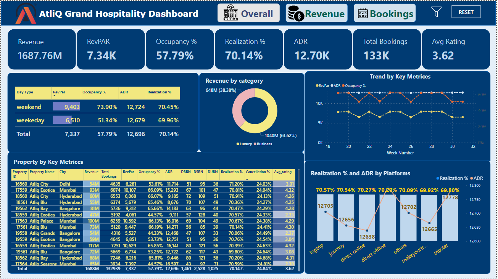
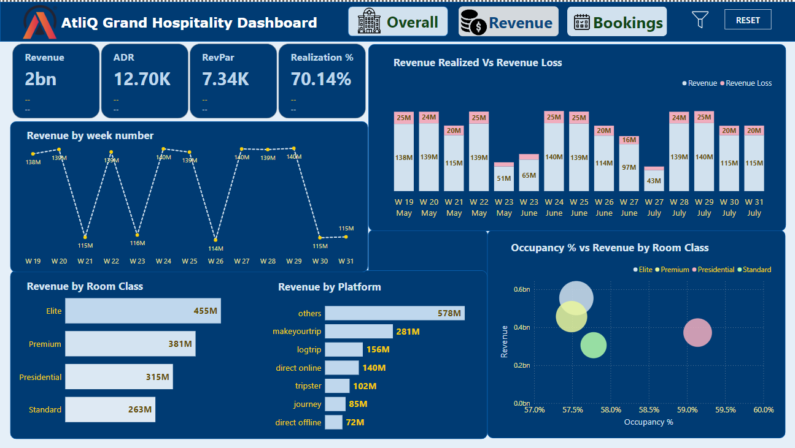
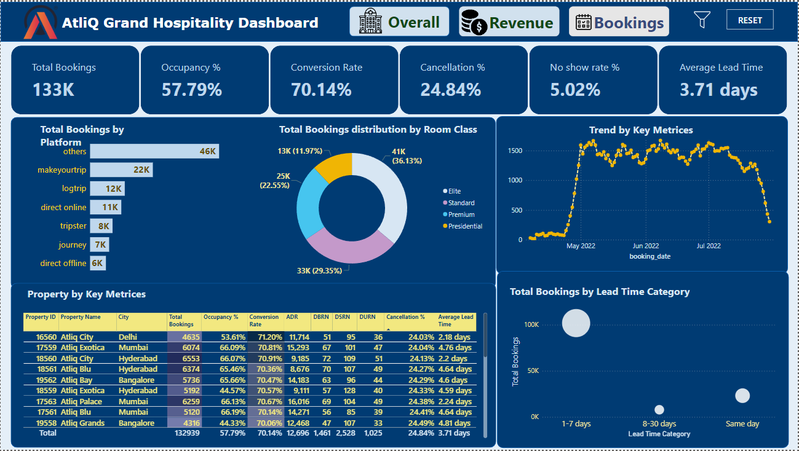

# Hotel Revenue Insights (Power BI)

## 📊 Overview

This project presents an end-to-end hospitality analytics solution built using Power BI. It focuses on analyzing hotel revenue, occupancy trends, and booking performance to generate actionable business insights.

## 🎯 Objective

To help stakeholders understand key performance metrics such as revenue, occupancy rate, and booking behavior, enabling data-driven decision-making in the hospitality sector.

## 🛠 Tools & Technologies

* Power BI (Data Visualization)
* DAX (Calculated Measures)
* SQL (Data Analysis)
* Excel/CSV (Data Source)

## 🧩 Data Model

The project follows a structured data model with fact and dimension tables:

* **fact_bookings**
* **fact_aggregated_bookings**
* **dim_date**
* **dim_hotels**
* **dim_rooms**

## 📈 Key Metrics (KPIs)

* Total Revenue
* Occupancy Rate (%)
* Average Daily Rate (ADR)
* Revenue Per Available Room (RevPAR)
* Cancellation Rate

## 📊 Dashboard Insights

* Revenue trends across cities and time periods
* Higher occupancy observed during weekends
* Certain cities contribute significantly to total revenue
* Booking cancellations impact overall profitability

## 📷 Dashboard Preview

(Add your dashboard screenshot here)

## Project Screenshots

### Overall Dashboard

### Revenue Dashboard

### Bookings Dashboard

## 🚀 Business Impact

* Identifies high-performing cities and hotels
* Helps optimize pricing and occupancy strategies
* Supports better forecasting and decision-making

## 📌 Conclusion

This project demonstrates how Power BI can be leveraged to transform raw hospitality data into meaningful insights that drive business performance.

## Acknowledgements

This dataset and project are part of the Codebasics Resume Challenge 1. Thanks to Codebasics for this incredible opportunity!

[Live Dashboard Link](https://app.powerbi.com/view?r=eyJrIjoiY2M0NGQ2OTAtMjBjMi00NzNjLWE0M2YtNzQ2NTUwYmMzZmMwIiwidCI6ImM2ZTU0OWIzLTVmNDUtNDAzMi1hYWU5LWQ0MjQ0ZGM1YjJjNCJ9)

## 👨‍💻 Author

Ayush Upadhyay

## Contact

For any questions or feedback, please contact [Ayush Upadhyay] at [ayushup345@gmail.com].

---

Feel free to clone the repository and explore the project in detail. Contributions are welcome!
